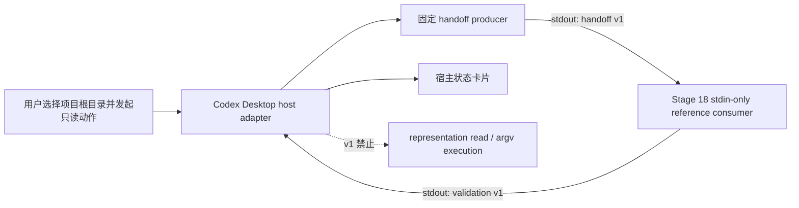

<!-- parents: 78-control-panel-host-integration-boundary.md, 79-read-only-host-consumer-validation-boundary.md -->
<!-- relates: 77-read-only-control-plane-milestone-freeze.md, 64-versioning-governance.md -->

# 80 — Codex Desktop Read-only Adapter Design Gate

> 状态：**Stage 19 design gate 已冻结（仅冻结边界，不实现 bridge）**
> 日期：2026-07-15
> 前置事实源：`docs/78-control-panel-host-integration-boundary.md`、`docs/79-read-only-host-consumer-validation-boundary.md`

## 1. 决策摘要

Stage 19 选择 **Codex Desktop 的本地任务进程边界**作为第一个真实宿主候选，但不实现 Codex Desktop 插件、内部 API 耦合或 UI 扩展。第一拍只冻结一个可由宿主侧实现的、一次性、只读的 adapter contract：

```text
codex-desktop-read-only-adapter/v1
```

该 adapter 的职责到此为止：

1. 由用户选择并授权一个项目根目录；
2. 启动固定的 Control Panel handoff producer 命令，接收一份 `control-plane/control-panel-handoff/v1` descriptor；
3. 将 descriptor 原样（不落盘）交给 Stage 18 reference consumer；
4. 只根据 validation result 映射宿主状态；
5. 在 v1 中**不读取 snapshot/HTML representation，不执行 descriptor argv，不刷新，不写文件**。

这是一项**设计冻结**，不是生产代码变更。Stage 20 才评估是否实现宿主侧 adapter，以及是否引入明确用户动作触发的 representation read。

## 2. 为什么选这个对象

### 2.1 选择 Codex Desktop 的本地任务进程边界

选择理由：

- 当前项目已有本地 CLI、stdio handoff 和 stdin-only consumer，能形成最小可验证链路；
- 不需要假设 Codex Desktop 存在未公开的插件协议或长期运行服务；
- 宿主只需管理一次短进程生命周期，符合现有 no-service / no-network / no-write 基线；
- 设计结果仍保持可迁移：未来 QwenPaw 或其他宿主可复用同一 descriptor 与 validation contract。

“Codex Desktop”在本文中指**用户发起的本地任务宿主**，不是对 Codex Desktop 内部实现、扩展点或产品行为的承诺。任何专有接入都必须在宿主侧完成，不能把宿主依赖倒灌进 `agent_runtime` producer。

### 2.2 不选择的方案

- **直接实现 Codex Desktop/QwenPaw bridge**：本阶段没有已冻结的宿主 API、生命周期和授权模型，延期到 Stage 20。
- **新增 `orchestration control-panel consume`**：会把独立 consumer 重新耦合进 producer，削弱 Stage 18 的 drift 检测价值。
- **live service / HTTP / WebSocket**：引入端口、session、auth、后台生命周期和新的攻击面，继续延期。
- **controlled artifact export**：涉及新的受控写入事务，不与只读 adapter 设计混合。

## 3. v1 端到端边界



### 3.1 允许的输入

宿主 adapter 只接受：

- 用户明确选择的项目根目录；
- 可选的、由宿主自身固定配置的安全参数；
- producer stdout 中的一份 JSON descriptor；
- reference consumer stdout 中的一份 JSON validation result。

v1 不接受：

- URL、socket、HTTP endpoint、任意文件路径输入或环境变量注入；
- `.env`、credential、token、keyring、证书或任何敏感文件；
- descriptor 中声明的 argv 作为宿主控制参数；
- 任意 shell 字符串、shell 拼接命令或用户提供的命令模板。

### 3.2 固定 bootstrap 命令

宿主如需取得 descriptor，只能调用固定的 producer 入口：

```text
python -m agent_runtime.cli orchestration control-panel handoff --json
```

该命令属于**adapter 自身的固定 bootstrap**，不是对 descriptor `snapshot.argv` 或 `render.argv` 的执行。若未来支持 envelope-scoped read，必须由宿主显式选择一个经过项目根目录归一化和边界校验的输入，不能从 descriptor 反向获得新的命令或路径。

v1 默认不传 envelope，因此 run、approval、artifact 等 request-scoped 区段保持 `scoped_unavailable` 是预期结果，而不是错误。

## 4. 进程生命周期

adapter 是一次性、前台、可取消的短进程流程：

```text
created
  -> producing
  -> validating
  -> ready | blocked | validation_failed | error
  -> closed
```

冻结规则：

- 每次宿主动作只消费一份 descriptor；完成后关闭 producer 和 consumer；
- 不启动 daemon、server、watch、polling、background process 或长期 stdin；
- 宿主必须设置有限总超时，推荐 v1 默认 30 秒，最长不得超过 60 秒；
- 超时、取消、进程启动失败或 stdout 非 JSON 均映射为 `error`，不得自动重试；
- 用户可显式发起新的独立动作重试；adapter 不复用上一次 descriptor 或 validation result；
- producer stderr 不进入 descriptor，不复制到 validation result；正常门禁失败仍以 JSON stdout 返回。

宿主可以在内存中保留当前动作的安全摘要，但不得把 descriptor、representation 或原始 argv 自动写入项目文件、ledger、draft 或宿主侧持久缓存。

## 5. Descriptor 与 validation result 接收契约

### 5.1 producer descriptor

producer stdout 必须是 Stage 17 的：

```text
control-plane/control-panel-handoff/v1
```

adapter 必须把 stdout 作为有界 UTF-8 JSON 文档处理，并在交给 consumer 前拒绝：

- 空输入、超出 1 MiB、非 UTF-8、非法 JSON、duplicate object key；
- 多余 stdout 文档或混入非 JSON 内容；
- producer 进程非零退出但未能形成可验证 descriptor。

adapter 不重新实现 handoff identity，也不建立第二套 snapshot/render identity。identity、shape、boundary 和脱敏校验统一由 Stage 18 reference consumer 负责。

### 5.2 validation result

consumer stdout 必须是 Stage 18 的：

```text
control-plane/control-panel-host-consumer-validation/v1
```

adapter 只接受严格 JSON object，并要求：

- `consumer == local-reference-consumer/v1`；
- `status == pass` 才能进入 `ready`；
- `status == blocked`、`validation_failed` 或 `error` 均不得读取 representation；
- 未知 schema/version、未知字段、缺失关键字段或非 JSON 输出均 fail closed。

adapter 不复制原始 descriptor，也不向宿主 UI 回显完整 argv、绝对路径、secret 或 credential。宿主可展示的内容仅限 validation result 中的安全 rule id、固定消息、检查状态和结构化 `next_action`。

## 6. 错误映射

| 来源 | host 状态 | 允许的下一步 |
|:---|:---|:---|
| producer/consumer exit `0`，validation `pass` | `ready` | 显示“只读 handoff 已验证”；不自动读取 representation |
| validation `blocked` 或 producer status 非 `pass` | `blocked` | 显示安全 finding；要求用户修正边界或输入后重新发起 |
| validation `validation_failed`、schema/identity/shape drift | `validation_failed` | 显示 contract drift；停止本次动作，不降级接受 |
| 启动失败、超时、取消、非 UTF-8、非 JSON、内部 I/O 错误 | `error` | 显示固定安全错误；不自动重试，不执行任何 argv |

状态映射必须保持单调安全：

```text
error / validation_failed / blocked 不能升级为 ready
```

adapter 不根据 producer 的 `next_action` 自动执行命令；`next_action` 只是安全提示。

## 7. Representation 读取边界

Stage 19 明确冻结：**v1 不读取 representation**。

因此，即使 validation 为 `pass`，adapter 也不得：

- 执行 descriptor 中的 `snapshot.argv` 或 `render.argv`；
- 自动打开浏览器、读取 HTML、读取 snapshot 文件或创建临时 artifact；
- 自动刷新、轮询或对比新的 snapshot；
- 把 descriptor 中的命令数组转成 shell 字符串；
- 把“只读 representation”误认为“已授权的 adapter execution”。

`ready` 的语义仅是“descriptor 的只读 handoff contract 已通过独立验证”。它不表示 representation 已加载，也不表示任何 run、approval、artifact 或 adapter 已执行。

Stage 20 如要增加 representation read，必须单独冻结：

1. 用户显式动作与授权提示；
2. argv allowlist 与 project-root 路径校验；
3. 新的进程/超时/取消/输出上限；
4. HTML/JSON 内容脱敏和不落盘策略；
5. 与 Stage 18 validation result 的关联 identity；
6. no-write、no-network、no-service 和 no-adapter-execution 回归证据。

## 8. 授权与安全边界

v1 的授权粒度只有“用户允许在指定项目根目录做一次只读 handoff validation”。它不携带、更不推导以下授权：

- 运行 descriptor argv；
- 发送消息、访问网络或调用外部系统；
- 写入 ledger、draft、artifact 或任意项目文件；
- resolve approval、submit task、commit run、retry/fallback；
- 读取 credential、token、keyring 或敏感配置；
- 启动长期服务、后台任务或在线探测。

宿主侧实现必须：

- 将 cwd 固定为用户选择的 project root；
- 使用 argv 数组调用固定 bootstrap，不经过 shell；
- 对子进程环境采用最小白名单，不把宿主 secret 注入子进程；
- 在进程结束后释放 stdin/stdout/stderr 句柄；
- 对所有非 `pass` 结果 fail closed；
- 不因 UI 便利而扩大 producer 或 consumer 的权限。

## 9. 兼容与迁移

- 只支持 handoff v1 与 validation v1；版本变化必须显式升级 adapter contract；
- adapter 不导入 `agent_runtime.orchestration_control_panel`、`agent_runtime.cli` 或 producer 实现；
- producer、reference consumer、宿主 adapter 三者通过 stdout/stdin JSON contract 解耦；
- QwenPaw 或其他宿主可复用本设计的 contract，但必须分别提交自己的 host-specific design gate；
- 不为 Codex Desktop 增加项目内专有模块、配置、依赖或服务入口，直到 Stage 20 实现决策通过。

## 10. Design gate 验收结论

Stage 19 设计 gate 通过的依据：

- 已选择一个真实宿主候选：Codex Desktop 本地任务进程边界；
- 已冻结 descriptor 与 validation result 的接收方式和 schema/version；
- 已冻结一次性进程生命周期、超时、取消、关闭和不自动重试语义；
- 已冻结 `pass` / `blocked` / `validation_failed` / `error` 的宿主映射；
- 已冻结 v1 representation 不读取、不执行 argv、不刷新、不落盘；
- 已冻结用户授权仅覆盖一次项目根目录内的只读 handoff validation；
- 已明确 producer、consumer 与未来 host adapter 不建立平行 identity 或聚合管线；
- 已列出 Stage 20 实现前必须重新验收的项目。

因此：

> Stage 19 **设计已冻结，生产代码仍不变**。下一阶段只能从本文件的 Stage 20 prerequisites 进入实现评估，不得绕过设计直接添加 Codex Desktop/QwenPaw 专有 bridge。

## 11. Stage 20 prerequisites

进入实现前必须先完成：

1. 宿主侧是否具备安全启动本地固定 bootstrap 的能力确认；
2. 宿主侧 UI/任务状态如何展示安全 finding 的最小映射确认；
3. producer 与 reference consumer 的真实跨进程 smoke test 方案；
4. Windows 路径、编码、进程取消和超时行为的验收矩阵；
5. 是否需要 envelope-scoped representation 的用户需求确认；
6. 实现范围、文件归属、依赖和回滚策略的独立计划；
7. 全量 pytest、doctor、public scan、controlled-write regression、compileall、docs context、pre-commit 与 diff check 证据。

本设计 gate 不创建 tag、不 push、不启动外部服务、不访问网络，也不修改生产代码。

Stage 20 实现与验收见 `docs/archive/81-codex-desktop-read-only-adapter-implementation.md`。
